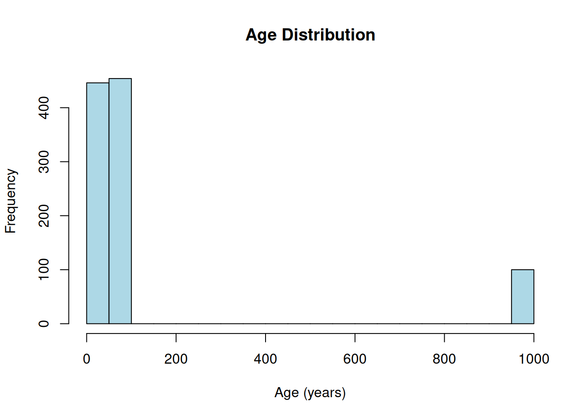
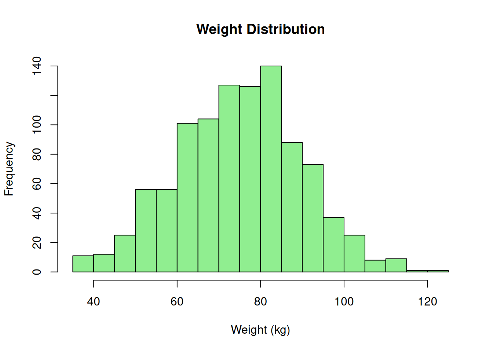

# Generating categorical and continuous variables

**About this vignette:** This tutorial teaches the fundamentals of
generating categorical and continuous variables. You’ll learn how to use
[`create_cat_var()`](https://big-life-lab.github.io/MockData/reference/create_cat_var.md)
and
[`create_con_var()`](https://big-life-lab.github.io/MockData/reference/create_con_var.md)
to generate individual variables with precise control over distributions
and proportions. All code examples run during vignette build to ensure
accuracy.

## Overview

MockData provides two core functions for generating the most common
variable types:

- **[`create_cat_var()`](https://big-life-lab.github.io/MockData/reference/create_cat_var.md)** -
  Categorical variables (smoking status, education level, disease
  diagnosis)
- **[`create_con_var()`](https://big-life-lab.github.io/MockData/reference/create_con_var.md)** -
  Continuous variables (age, weight, blood pressure, income)

This tutorial focuses on the basics of these two variable types. For
specialized topics, see:

- [Missing
  data](https://big-life-lab.github.io/MockData/articles/tutorial-missing-data.md) -
  Survey missing codes and NA patterns
- [Garbage
  data](https://big-life-lab.github.io/MockData/articles/tutorial-garbage-data.md) -
  Data quality testing with intentional errors
- [Date
  variables](https://big-life-lab.github.io/MockData/articles/tutorial-dates.md) -
  Temporal data and survival times

## Categorical variables

Categorical variables represent discrete categories with specific
meanings. Examples: smoking status, education level, disease diagnosis.

### Basic categorical variable

Let’s generate smoking status from the minimal-example metadata:

> **About example data paths**
>
> These examples use
> [`system.file()`](https://rdrr.io/r/base/system.file.html) to load
> example metadata included with the MockData package. In your own
> projects, you’ll use regular file paths:
>
> ``` r
>
> # Package examples use:
> variables <- read.csv(
>   system.file("extdata/minimal-example/variables.csv", package = "MockData"),
>   stringsAsFactors = FALSE, check.names = FALSE
> )
>
> # Your code will use:
> variables <- read.csv(
>   "path/to/your/variables.csv",
>   stringsAsFactors = FALSE, check.names = FALSE
> )
> ```

``` r

# Load minimal-example metadata
variables <- read.csv(
  system.file("extdata/minimal-example/variables.csv", package = "MockData"),
  stringsAsFactors = FALSE,
  check.names = FALSE
)

variable_details <- read.csv(
  system.file("extdata/minimal-example/variable_details.csv", package = "MockData"),
  stringsAsFactors = FALSE,
  check.names = FALSE
)

# Generate smoking status (categorical variable)
smoking <- create_cat_var(
  var = "smoking",
  databaseStart = "minimal-example",
  variables = variables,
  variable_details = variable_details,
  n = 1000,
  seed = 123
)

# View structure
head(smoking)
```

      smoking
    1       1
    2       2
    3       1
    4       3
    5       3
    6       1

``` r

str(smoking)
```

    'data.frame':   1000 obs. of  1 variable:
     $ smoking: Factor w/ 4 levels "1","2","3","7": 1 2 1 3 3 1 2 3 2 1 ...

### Categorical variable proportions

The `proportion` column in variable_details.csv controls the
distribution of categories:

**Smoking proportions from metadata:**

|     | recStart | catLabel       | proportion |
|:----|:---------|:---------------|-----------:|
| 5   | 1        | Never smoker   |       0.50 |
| 6   | 2        | Former smoker  |       0.30 |
| 7   | 3        | Current smoker |       0.17 |
| 8   | 7        | Don’t know     |       0.03 |

**Observed distribution:**

``` r

# Check the distribution
table(smoking$smoking)
```


      1   2   3   7
    505 305 160  30 

``` r

prop.table(table(smoking$smoking))
```


        1     2     3     7
    0.505 0.305 0.160 0.030 

**Key insight:** The observed proportions closely match the metadata
specifications. MockData samples categories according to the specified
proportions.

### Understanding categorical metadata

For smoking (cchsflow_v0002), the metadata specifies:

**In variables.csv:**

- `variableType = "Categorical"`
- `rType = "factor"` - Output as R factor with levels

**In variable_details.csv:**

- Each category has its own row
- `recStart` contains the category code (“1”, “2”, “3”)
- `proportion` must sum to 1.0 across all categories

**Proportion validation:** Sum = 1 (must be 1.0 ± 0.01)

## Continuous variables

Continuous variables represent numeric measurements on a scale.
Examples: age, BMI, blood pressure, income.

### Basic continuous variable (integer)

Let’s generate age from the minimal-example metadata:

``` r

# Generate age (continuous variable with integer output)
age <- create_con_var(
  var = "age",
  databaseStart = "minimal-example",
  variables = variables,
  variable_details = variable_details,
  n = 1000,
  seed = 456
)

# View structure
head(age)
```

      age
    1  30
    2  59
    3  62
    4  29
    5  39
    6  45

``` r

str(age)
```

    'data.frame':   1000 obs. of  1 variable:
     $ age: int  30 59 62 29 39 45 60 54 65 59 ...

### Continuous variable distributions

Continuous variables use statistical distributions to generate realistic
values:

``` r

# Check the distribution
summary(age$age)
```

       Min. 1st Qu.  Median    Mean 3rd Qu.    Max.
      18.00   42.00   52.00  145.52   65.25  999.00 

``` r

hist(age$age, breaks = 30, main = "Age Distribution", xlab = "Age (years)", col = "lightblue")
```



**Distribution parameters from metadata:**

- Distribution: normal
- Mean: 50
- Standard deviation: 15

**Interpretation:** Age is drawn from a normal distribution with mean =
50 and SD = 15, truncated to the valid range specified in
variable_details.csv. Notice the peak at 999—in raw data from complex
sources like surveys, missing codes are often unrealistically high or
low values. This is by design, but it can generate unusual patterns in
the data distribution. See the [Missing data
tutorial](https://big-life-lab.github.io/MockData/articles/tutorial-missing-data.md)
for more information.

### Understanding continuous metadata

For age (cchsflow_v0001), the metadata specifies:

**In variables.csv:**

- `variableType = "Continuous"`
- `rType = "integer"` - Output as whole numbers
- `distribution = "normal"` - Use normal distribution
- `mean = 50`, `sd = 15` - Distribution parameters

**In variable_details.csv:**

- `recStart = "[18,100]"` - Valid range (interval notation)
- `proportion = NA` - Not applicable for continuous variables

The normal distribution is truncated to \[18, 100\], ensuring no invalid
ages are generated.

### Continuous variable (double precision)

Let’s generate weight, which requires decimal precision:

``` r

# Generate weight (continuous variable with double precision)
weight <- create_con_var(
  var = "weight",
  databaseStart = "minimal-example",
  variables = variables,
  variable_details = variable_details,
  n = 1000,
  seed = 789
)

# View structure
head(weight)
```

        weight
    1 82.86145
    2 41.08848
    3 74.70480
    4 77.74710
    5 69.57973
    6 67.73274

``` r

str(weight)
```

    'data.frame':   1000 obs. of  1 variable:
     $ weight: num  82.9 41.1 74.7 77.7 69.6 ...

``` r

# Check the distribution
summary(weight$weight)
```

       Min. 1st Qu.  Median    Mean 3rd Qu.    Max.
      35.00   64.40   75.41   74.88   84.59  120.78 

``` r

hist(weight$weight, breaks = 30, main = "Weight Distribution", xlab = "Weight (kg)", col = "lightgreen")
```



**Weight parameters:**

- Distribution: normal
- Mean: 75 kg
- Standard deviation: 15 kg
- Output type: double (decimal values)

**Difference from age:** Weight uses `rType = "double"` to preserve
decimal precision (e.g., 72.3, 85.7), while age uses `rType = "integer"`
for whole numbers (e.g., 45, 67).

## Comparing categorical vs continuous

| Aspect | Categorical | Continuous |
|----|----|----|
| **Use case** | Discrete categories | Numeric measurements |
| **Examples** | Smoking status, education | Age, weight, income |
| **Distribution** | Proportions | Statistical (normal, uniform) |
| **variable_details** | Multiple rows (one per category) | Single row (range specification) |
| **proportion column** | Required (must sum to 1.0) | NA (not applicable) |
| **recStart** | Category codes (“1”, “2”, “3”) | Interval notation (“\[18,100\]”) |
| **Output types** | factor, character | integer, double |

## When to use individual functions vs create_mock_data()

**Use
[`create_cat_var()`](https://big-life-lab.github.io/MockData/reference/create_cat_var.md)
or
[`create_con_var()`](https://big-life-lab.github.io/MockData/reference/create_con_var.md)
when:**

- Testing a single variable interactively
- Exploring distribution parameters
- Debugging metadata specifications
- Generating variables one at a time for specific tests

**Use
[`create_mock_data()`](https://big-life-lab.github.io/MockData/reference/create_mock_data.md)
when:**

- Generating complete datasets with multiple variables
- Need all variables generated together
- Production workflows with saved metadata files

**Example: Batch generation**

``` r

# Generate multiple variables at once
mock_data <- create_mock_data(
  databaseStart = "minimal-example",
  variables = variables,
  variable_details = variable_details,
  n = 1000,
  seed = 100
)

# Check which variables were generated
names(mock_data)
```

    [1] "age"            "smoking"        "BMI"            "height"
    [5] "weight"         "interview_date"

``` r

head(mock_data[, c("smoking", "age", "weight")])
```

      smoking age   weight
    1       1  42 88.22128
    2       1  52 69.28890
    3       1  49 39.45189
    4       2  63 87.50134
    5       1  52 57.72547
    6       2  55 63.62102

**Result:** All enabled variables generated in a single call,
maintaining consistent sample size and relationships.

## Distribution types for continuous variables

MockData supports two distributions for continuous variables:

### Normal distribution

Most common for naturally-varying measurements:

**Parameters:**

- `distribution = "normal"`
- `mean` - Center of distribution
- `sd` - Spread (standard deviation)

**Examples:**

- Age (mean = 50, sd = 15)
- Weight (mean = 75, sd = 15)
- Height (mean = 1.7, sd = 0.1)

**Properties:**

- Bell-shaped curve
- Symmetric around mean
- ~68% within 1 SD, ~95% within 2 SD
- Values truncated to valid range

### Uniform distribution

Equal probability across entire range:

**Parameters:**

- `distribution = "uniform"`
- No additional parameters needed
- Uses range from variable_details.csv

**Example configuration:**

``` csv
# variables.csv
uid,variable,distribution
v010,participant_id,uniform

# variable_details.csv
uid,variable,recStart
v010,participant_id,"[1000,9999]"
```

**Use cases:**

- ID numbers
- Random assignment codes
- Variables without known distribution

## Proportions for categorical variables

Proportions control the population distribution of categories. They must
sum to 1.0 (±0.01 tolerance).

### Example: Realistic smoking prevalence

| catLabel       | proportion |
|:---------------|-----------:|
| Never smoker   |       0.50 |
| Former smoker  |       0.30 |
| Current smoker |       0.17 |
| Don’t know     |       0.03 |

These proportions might reflect:

- Published health survey statistics
- Literature values for the population
- Target distributions for study design

### Matching published statistics

The proportion specification allows you to generate mock data that
matches “Table 1” descriptive statistics from published papers.

**Example scenario:** A paper reports:

- Never smokers: 50%
- Former smokers: 30%
- Current smokers: 17%
- Don’t know: 3%

By setting these proportions in variable_details.csv, your mock data
will match the published distribution.

## Output data types (rType)

The `rType` column in variables.csv controls the R data type of the
output:

### For categorical variables

**factor (recommended):**

- Preserves category levels
- Required for statistical modeling
- Example: smoking status

**character:**

- Plain text representation
- Use for IDs or non-analyzable categories
- Example: participant ID, study site

### For continuous variables

**integer:**

- Whole numbers only
- Use for counts, age in years
- Example: age, number of children

**double:**

- Decimal precision
- Use for measurements requiring precision
- Example: weight, blood pressure, lab values

**Example comparison:**

``` r

# Age: integer (no decimals)
head(age$age)
```

    [1] 30 59 62 29 39 45

``` r

# Weight: double (decimal precision)
head(weight$weight)
```

    [1] 82.86145 41.08848 74.70480 77.74710 69.57973 67.73274

## Checking generated data

Always verify that generated data matches your expectations:

### For categorical variables

``` r

# Check factor levels
levels(smoking$smoking)
```

    [1] "1" "2" "3" "7"

``` r

# Check proportions
prop.table(table(smoking$smoking))
```


        1     2     3     7
    0.505 0.305 0.160 0.030 

``` r

# Verify data type
class(smoking$smoking)
```

    [1] "factor"

### For continuous variables

``` r

# Check range
range(age$age, na.rm = TRUE)
```

    [1]  18 999

``` r

# Check distribution parameters
mean(age$age, na.rm = TRUE)
```

    [1] 145.52

``` r

sd(age$age, na.rm = TRUE)
```

    [1] 284.5324

``` r

# Verify data type
class(age$age)
```

    [1] "integer"

**Validation checklist:**

Proportions sum to ~1.0 (categorical)

Values within expected range (continuous)

Correct data type (factor, integer, double)

Sample size matches n parameter

Distribution shape looks reasonable (histogram)

## Key concepts summary

| Concept | Implementation | Details |
|----|----|----|
| **Categorical variables** | [`create_cat_var()`](https://big-life-lab.github.io/MockData/reference/create_cat_var.md) | Discrete categories with proportions |
| **Continuous variables** | [`create_con_var()`](https://big-life-lab.github.io/MockData/reference/create_con_var.md) | Numeric measurements with distributions |
| **Proportions** | In variable_details.csv | Must sum to 1.0 for categorical |
| **Distributions** | normal, uniform | Specified in variables.csv |
| **Output types** | rType column | factor, character, integer, double |
| **Metadata validation** | Automatic | Proportions, ranges, types checked |
| **Batch generation** | [`create_mock_data()`](https://big-life-lab.github.io/MockData/reference/create_mock_data.md) | Multiple variables at once |

## What you learned

In this tutorial, you learned:

- **Categorical variables:** Using
  [`create_cat_var()`](https://big-life-lab.github.io/MockData/reference/create_cat_var.md)
  to generate variables with discrete categories
- **Proportions:** How to specify and validate category distributions
- **Continuous variables:** Using
  [`create_con_var()`](https://big-life-lab.github.io/MockData/reference/create_con_var.md)
  to generate numeric measurements
- **Distributions:** Normal and uniform distributions for continuous
  data
- **Output types:** Choosing appropriate rType (factor, integer, double)
  for each variable
- **Metadata structure:** How variables.csv and variable_details.csv
  work together
- **Individual vs batch:** When to use single-variable functions vs
  [`create_mock_data()`](https://big-life-lab.github.io/MockData/reference/create_mock_data.md)
- **Validation:** Checking that generated data matches metadata
  specifications

## Next steps

**Continue learning:**

- [Date
  variables](https://big-life-lab.github.io/MockData/articles/tutorial-dates.md) -
  Temporal data and event times
- [Survival
  data](https://big-life-lab.github.io/MockData/articles/tutorial-survival-data.md) -
  Competing risks and censoring
- [Missing
  data](https://big-life-lab.github.io/MockData/articles/tutorial-missing-data.md) -
  Survey missing codes (NA::a vs NA::b)
- [Garbage
  data](https://big-life-lab.github.io/MockData/articles/tutorial-garbage-data.md) -
  Data quality testing

**Reference:**

- [Configuration
  reference](https://big-life-lab.github.io/MockData/articles/reference-config.md) -
  Complete metadata schema
- [Getting
  started](https://big-life-lab.github.io/MockData/articles/getting-started.md) -
  Overview and first examples
